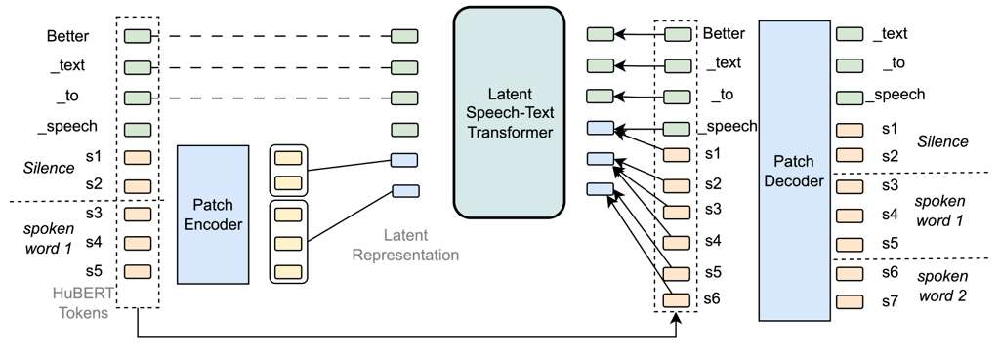

*Latent Speech-Text Transformer (LST)*

This repository contains the code for our paper:

**“Latent Speech-Text Transformer”**  
Accepted to **ICLR 2026 (Oral)**

- Paper: https://arxiv.org/abs/2510.06195 


## Abstract
Auto-regressive speech–text models trained on interleaved text and discretized speech tokens have demonstrated strong capabilities. However, they remain significantly less compute-efficient than text LLMs due to much longer speech token sequences than text tokens. This modality imbalance allocates disproportionate compute to speech during training and inference, potentially limiting cross-modal alignment and slowing performance scaling by orders of magnitude. 

We introduce the Latent Speech-Text Transformer (LST), which aggregates speech tokens into latent speech patches that serve as higher-level autoregressive units. This design aligns the sequence-modeling granularity between speech and text while improving computational efficiency. These latent speech patches align with textual units, facilitating cross-modal knowledge transfer while compactly capturing recurring acoustic patterns such as silence. Across story-completion benchmarks, LST improves speech understanding, achieving up to +6.5% absolute gain on speech HellaSwag. Improvements grow with scale under compute-controlled training. LST also benefits downstream tasks by stabilizing ASR adaptation and reducing effective autoregressive sequence length during ASR and TTS inference.




## Development Status

We are actively preparing the LST code to make it easier to reproduce our results. Please open an issue if you encounter problems or have questions.


## Quick start

There are three ways you can create your environment.

### Option 1: conda + pip

Run these commands in your terminal or a script:

```bash
git clone https://github.com/facebookresearch/lst
cd lst
conda create -n lst python=3.12
conda activate lst
pip install --pre torch --index-url https://download.pytorch.org/whl/nightly/cu121
pip install ninja
pip install -v -U git+https://github.com/facebookresearch/xformers.git@de742ec3d64bd83b1184cc043e541f15d270c148
pip install -r requirements.txt
`````

### Option 2: Slurm Job to Build Env

```bash
git clone https://github.com/facebookresearch/lst
cd lst

bash setup/create_env.sh
# or if you have access to a SLURM cluster
sbatch setup/create_env.sh
`````

Once that is done you can activate the environment

```bash
conda activate lst_<date>
`````

### Options 3 (experimental, reproducible): uv

Run the following to install the env using [uv](https://docs.astral.sh/uv/).
The main benefit of this method is that the build is reproducible since there is a lock file.

```bash
uv pip install --group pre_build --no-build-isolation
uv pip install --group compile_xformers --no-build-isolation
uv sync
`````

---

# Training

**The provided configurations are templates, you need to adapt them for them to work (change `dump_dir`, `data.root_dir`, `data.tokenizer.path`, etc ...)**

```bash
# stool stands for SLURM tool !
python -m bytelatent.stool script=bytelatent.train config=bytelatent/configs/debug.yaml nodes=1 partition=<partition>
# if you want to launch locally you can use torchrun
torchrun --nproc-per-node 8 -m bytelatent.train config=bytelatent/configs/debug.yaml
# or you can also launch on 1 GPU
python -m bytelatent.train  config=bytelatent/configs/debug.yaml
`````

Note: The internal module name `bytelatent` is inherited from the original BLT codebase on which this implementation builds.

---

# Data

LST is trained on a mixture of **text data** and **interleaved speech-text data**.

## Text Data

Large-scale web text corpora.

## Speech Data

Speech datasets discretized into HuBERT tokens:

- LibriLight
- People’s Speech
- Multilingual LibriSpeech
- Spotify Podcasts

Speech tokens are generated at **25 Hz with a 501-entry codebook**.


## Linting

To lint, run the following command

```
bash dev/lint.sh
```


## Citation

If you find this work useful, please cite:

```
@article{lu2025latent,
  title={Latent Speech-Text Transformer},
  author={Lu, Yen-Ju and Gaur, Yashesh and Zhou, Wei and Muller, Benjamin and Villalba, Jesus and Dehak, Najim and Zettlemoyer, Luke and Ghosh, Gargi and Lewis, Mike and Iyer, Srinivasan and Le, Duc},
  journal={arXiv preprint arXiv:2510.06195},
  year={2025}
}
```

LST's implementation partially builds upon the BLT codebase.
If you build upon this repository, please consider citing BLT as well.

```
@inproceedings{pagnoni2025byte,
  title={Byte latent transformer: Patches scale better than tokens},
  author={Pagnoni, Artidoro and Pasunuru, Ramakanth and Rodriguez, Pedro and Nguyen, John and Muller, Benjamin and Li, Margaret and Zhou, Chunting and Yu, Lili and Weston, Jason E and Zettlemoyer, Luke and others},
  booktitle={Proceedings of the 63rd Annual Meeting of the Association for Computational Linguistics (Volume 1: Long Papers)},
  pages={9238--9258},
  year={2025}
}
```

---

# License
The LST code is partially based on Meta BLT.

Meta LST is licensed under CC-BY-NC-4.0. Refer to the LICENSE file in the top level directory.
